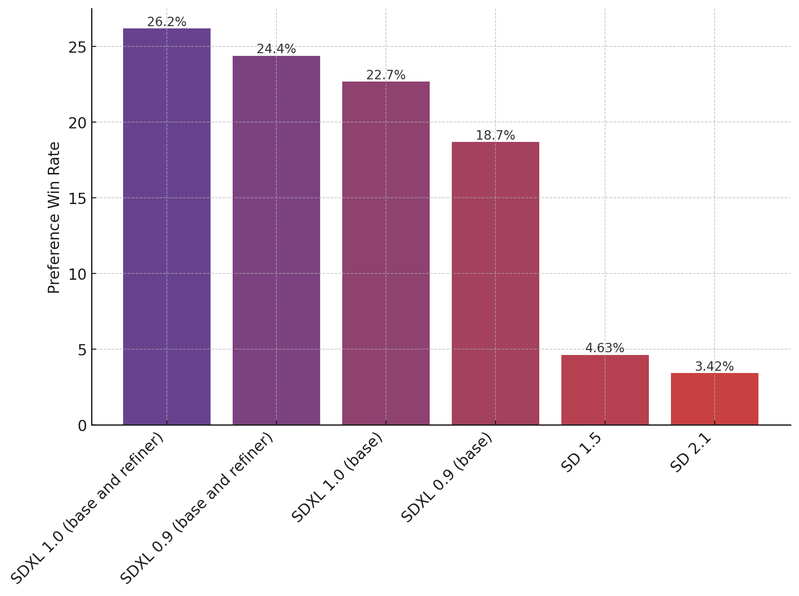

# SD-XL 1.0-refiner Model Card


## Model


[SDXL](https://arxiv.org/abs/2307.01952) consists of a mixture-of-experts pipeline for latent diffusion: 
In a first step, the base model (available here: https://huggingface.co/stabilityai/stable-diffusion-xl-base-1.0) is used to generate (noisy) latents, 
which are then further processed with a refinement model specialized for the final denoising steps.
Note that the base model can be used as a standalone module.

Alternatively, we can use a two-stage pipeline as follows: 
First, the base model is used to generate latents of the desired output size. 
In the second step, we use a specialized high-resolution model and apply a technique called SDEdit (https://arxiv.org/abs/2108.01073, also known as "img2img") 
to the latents generated in the first step, using the same prompt. This technique is slightly slower than the first one, as it requires more function evaluations.

Source code is available at https://github.com/Stability-AI/generative-models .

### Model Description

- **Developed by:** Stability AI
- **Model type:** Diffusion-based text-to-image generative model
- **License:** [CreativeML Open RAIL++-M License](https://huggingface.co/stabilityai/stable-diffusion-xl-refiner-1.0/blob/main/LICENSE.md)
- **Model Description:** This is a model that can be used to generate and modify images based on text prompts. It is a [Latent Diffusion Model](https://arxiv.org/abs/2112.10752) that uses two fixed, pretrained text encoders ([OpenCLIP-ViT/G](https://github.com/mlfoundations/open_clip) and [CLIP-ViT/L](https://github.com/openai/CLIP/tree/main)).
- **Resources for more information:** Check out our [GitHub Repository](https://github.com/Stability-AI/generative-models) and the [SDXL report on arXiv](https://arxiv.org/abs/2307.01952).

### Model Sources

For research purposes, we recommned our `generative-models` Github repository (https://github.com/Stability-AI/generative-models), which implements the most popoular diffusion frameworks (both training and inference) and for which new functionalities like distillation will be added over time.
[Clipdrop](https://clipdrop.co/stable-diffusion) provides free SDXL inference.

- **Repository:** https://github.com/Stability-AI/generative-models
- **Demo:** https://clipdrop.co/stable-diffusion


## Evaluation

The chart above evaluates user preference for SDXL (with and without refinement) over SDXL 0.9 and Stable Diffusion 1.5 and 2.1. 
The SDXL base model performs significantly better than the previous variants, and the model combined with the refinement module achieves the best overall performance.


### 🧨 Diffusers 

Make sure to upgrade diffusers to >= 0.18.0:
```
pip install diffusers --upgrade
```

In addition make sure to install `transformers`, `safetensors`, `accelerate` as well as the invisible watermark:
```
pip install invisible_watermark transformers accelerate safetensors
```

You can use the model then as follows
```py
from diffusers import DiffusionPipeline
import torch

pipe = DiffusionPipeline.from_pretrained("stabilityai/stable-diffusion-xl-base-1-0", torch_dtype=torch.float16, use_safetensors=True, variant="fp16")
pipe.to("cuda")

# if using torch < 2.0
# pipe.enable_xformers_memory_efficient_attention()

prompt = "An astronaut riding a green horse"

images = pipe(prompt=prompt).images[0]
```

When using `torch >= 2.0`, you can improve the inference speed by 20-30% with torch.compile. Simple wrap the unet with torch compile before running the pipeline:
```py
pipe.unet = torch.compile(pipe.unet, mode="reduce-overhead", fullgraph=True)
```

If you are limited by GPU VRAM, you can enable *cpu offloading* by calling `pipe.enable_model_cpu_offload`
instead of `.to("cuda")`:

```diff
- pipe.to("cuda")
+ pipe.enable_model_cpu_offload()
```


## Uses

### Direct Use

The model is intended for research purposes only. Possible research areas and tasks include

- Generation of artworks and use in design and other artistic processes.
- Applications in educational or creative tools.
- Research on generative models.
- Safe deployment of models which have the potential to generate harmful content.
- Probing and understanding the limitations and biases of generative models.

Excluded uses are described below.

### Out-of-Scope Use

The model was not trained to be factual or true representations of people or events, and therefore using the model to generate such content is out-of-scope for the abilities of this model.

## Limitations and Bias

### Limitations

- The model does not achieve perfect photorealism
- The model cannot render legible text
- The model struggles with more difficult tasks which involve compositionality, such as rendering an image corresponding to “A red cube on top of a blue sphere”
- Faces and people in general may not be generated properly.
- The autoencoding part of the model is lossy.

### Bias
While the capabilities of image generation models are impressive, they can also reinforce or exacerbate social biases.